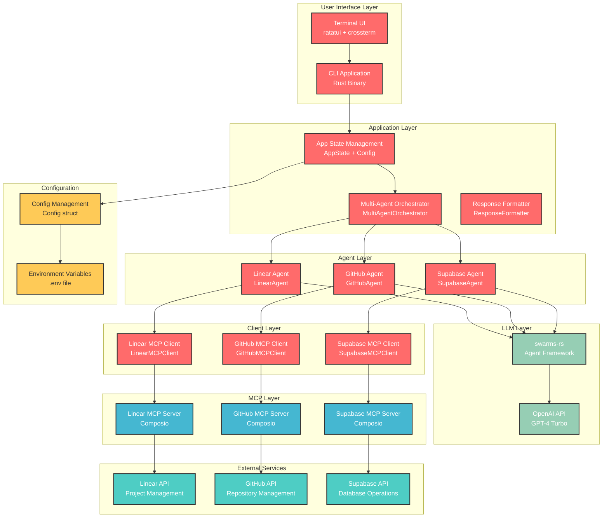
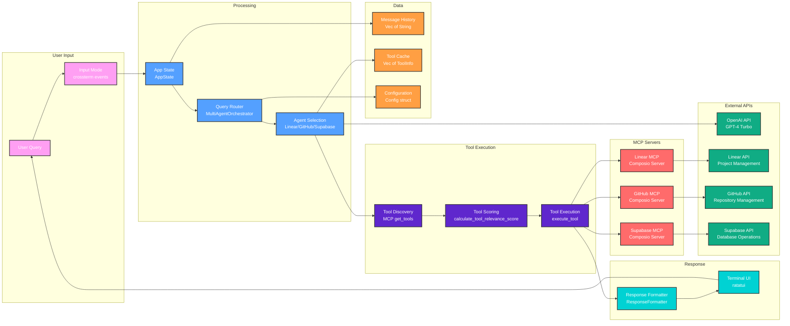
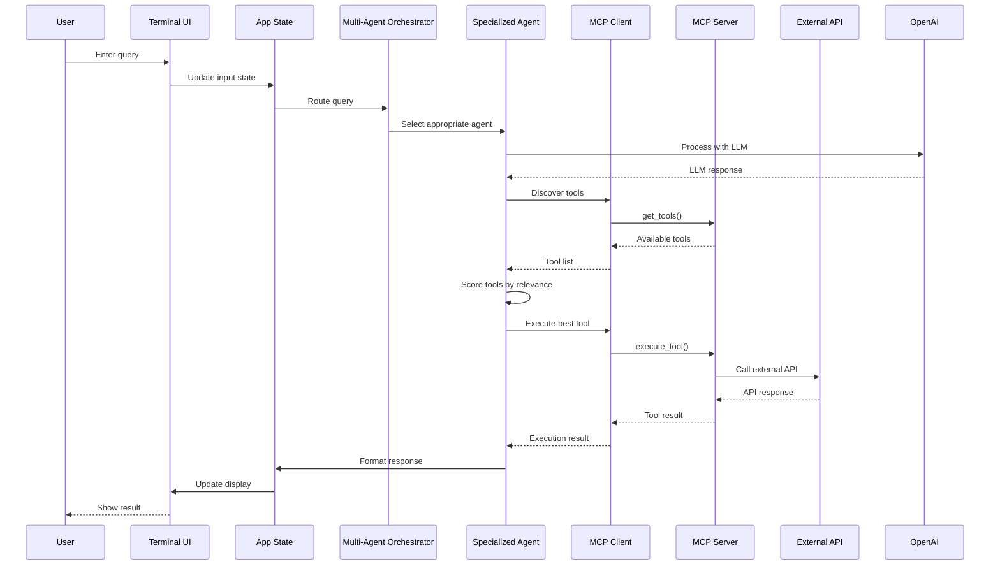
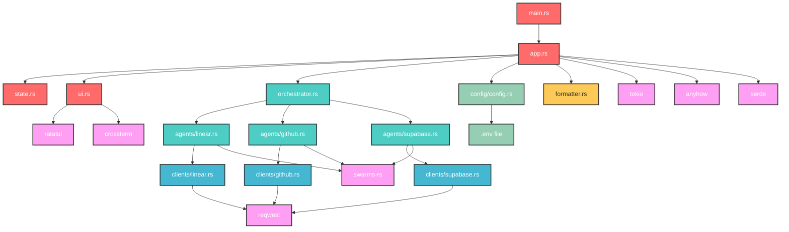

# CodePilot Architecture

## System Overview

## Detailed Component Architecture

## Technology Stack

```mermaid
graph TB
    %% Core Technologies
    subgraph "Core Technologies"
        Rust[Rust<br/>Programming Language]
        Tokio[Tokio<br/>Async Runtime]
        Serde[Serde<br/>Serialization]
        Anyhow[Anyhow<br/>Error Handling]
    end

    %% UI Technologies
    subgraph "UI Technologies"
        Ratatui[Ratatui<br/>Terminal UI]
        Crossterm[Crossterm<br/>Terminal Control]
    end

    %% AI/ML Technologies
    subgraph "AI/ML Technologies"
        Swarms[swarms-rs<br/>Agent Framework]
        OpenAI[OpenAI API<br/>GPT-4 Turbo]
    end

    %% Network Technologies
    subgraph "Network Technologies"
        Reqwest[Reqwest<br/>HTTP Client]
        SerdeJson[Serde JSON<br/>JSON Handling]
    end

    %% Configuration Technologies
    subgraph "Configuration"
        Dotenv[Dotenv<br/>Environment Variables]
        Chrono[Chrono<br/>Date/Time]
    end

    %% External Services
    subgraph "External Services"
        Linear[Linear<br/>Project Management]
        GitHub[GitHub<br/>Repository Management]
        Supabase[Supabase<br/>Database]
        Composio[Composio<br/>MCP Servers]
    end

    %% Dependencies
    Rust --> Tokio
    Rust --> Serde
    Rust --> Anyhow
    Rust --> Ratatui
    Rust --> Crossterm
    Rust --> Swarms
    Rust --> Reqwest
    Rust --> SerdeJson
    Rust --> Dotenv
    Rust --> Chrono

    %% Service Connections
    Swarms --> OpenAI
    Reqwest --> Linear
    Reqwest --> GitHub
    Reqwest --> Supabase
    Reqwest --> Composio

    %% Styling
    classDef coreTech fill:#ff6b6b,stroke:#333,stroke-width:2px,color:#fff
    classDef uiTech fill:#4ecdc4,stroke:#333,stroke-width:2px,color:#fff
    classDef aiTech fill:#45b7d1,stroke:#333,stroke-width:2px,color:#fff
    classDef networkTech fill:#96ceb4,stroke:#333,stroke-width:2px,color:#fff
    classDef configTech fill:#feca57,stroke:#333,stroke-width:2px,color:#333
    classDef externalService fill:#ff9ff3,stroke:#333,stroke-width:2px,color:#fff

    class Rust,Tokio,Serde,Anyhow coreTech
    class Ratatui,Crossterm uiTech
    class Swarms,OpenAI aiTech
    class Reqwest,SerdeJson networkTech
    class Dotenv,Chrono configTech
    class Linear,GitHub,Supabase,Composio externalService
```

## Data Flow Architecture

## Component Dependencies

## Key Features Highlighted

- **Multi-Agent Architecture**: Specialized agents for different domains
- **Dynamic Tool Discovery**: Tools fetched from MCP servers at runtime
- **Intelligent Routing**: Query routing based on content and agent capabilities
- **Beautiful Terminal UI**: Modern interface with real-time status updates
- **Robust Error Handling**: Graceful fallbacks and helpful error messages
- **Configuration Management**: Environment-based configuration
- **Type Safety**: Rust's type system ensures reliability
- **Async Operations**: Tokio runtime for concurrent operations 